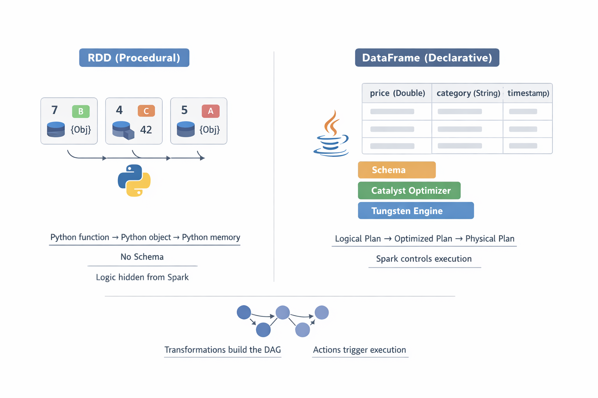

# Topic 2 - DataFrames vs RDDs


## What an RDD REALLY Is
> An RDD is an **immutable, distributed collection of Python objects** with a lineage graph.

RDD = **Resilient Distributed Dataset**

Break it down:

- **Distributed** → data is split across machines
- **Dataset** → a collection of records
- **Resilient** → Spark can rebuild lost data

**Key properties**
- **Distributed** across executors
- Partitioned
- Immutable
- Lazy
- Fault-tolerant via lineage
---
### Mental model

An RDD is:
> “A distributed list of objects + a recipe to rebuild it”

Important negatives:
 - Not a table.  
 - Not rows and columns.  
 - No schema
 Just **objects**.

Conceptually:

```java
RDD = [obj1, obj2, obj3, ...]
```
Each object can be _anything_:
- int
- string
- tuple
- dict
- custom class
Spark doesn’t care what’s inside the object.

That flexibility is also the problem.

RDDs are **procedural**:

> “Spark, do exactly this, step by step.”
---
### RDD Execution Model 

RDD execution in PySpark looks like this:
```scss
Python function → Python object → Python memory
```

For every record:
- JVM ↔ Python boundary is crossed
- Execution is row-by-row
- Spark cannot analyze or reorder logic
### The golden rule

> **RDDs are not _globally_ optimizable by Spark.**
> 
> or better way to read this as 
> 
> Spark can pipeline RDD operations, but it cannot **reorder, prune, or rewrite logic**.

Example
```python
map(lambda x: x.price * 1.18)
```
Spark does **not** know:
- what `price` is
- its data type
- whether it’s nullable
- whether operations can be reordered
- whether computation can be pushed down
Spark only sees **opaque functions**.

So Spark says:

> “Got it. I’ll execute this exactly as written.”

No optimization magic. Just brute force.

---
## What a DataFrame REALLY Is

**Definition**

> A DataFrame is a **distributed table with schema and a query plan**.

Or more precisely:

> **DataFrame = RDD + Schema + Query Plan**

### Key properties
- Named columns with types
- Declarative API
- Optimized execution
- Columnar storage

Instead of “a bag of objects”, Spark now sees:
```sql
Column: price (Double)
Column: category (String)
Column: timestamp (Timestamp)
```
---
### Mental model
```sql
DataFrame = Table + Schema + Optimizer
```

This is the moment Spark stops being dumb and starts being clever.

---
### Why Schema Is Power

Schema enables Spark to:
- Reorder operations
- Push filters early
- Drop unused columns
- Choose efficient join strategies
- Generate optimized JVM bytecode

> **No schema → no optimization.**

This is where **Catalyst** and **Tungsten** matter.
- **Catalyst** → query optimizer (logical → physical)
- **Tungsten** → execution engine (memory + CPU efficiency)
---
### Catalyst Optimizer (DataFrame Superpower)

Spark Catalyst transforms your code like this:

```scss
User Code → Logical Plan → Optimized Plan → Physical Plan
```

Optimizations include:
- Predicate pushdown
- Projection pruning
- Join reordering
- Constant folding
**RDDs skip Catalyst completely.**
---
### Tungsten (Why DataFrames Are Fast)
Memory representation is the real win.

**RDD memory:**
- Python objects
- Pointer heavy
- GC pressure

**DataFrame memory:**
- Columnar format
- Off-heap
- CPU cache friendly
- Vectorized execution
This is why DataFrames scale better and cost less.
---
## DAG & Lineage (Failure Recovery)

If a partition is lost:
- Spark recomputes it
- No manual retries
- No data loss

**RDD lineage**

```nginx
RDD3 ← RDD2 ← RDD1
```

**DataFrame lineage**

```nginx
Logical Plan → Recomputed
```

Different abstraction, same resilience.

> Transformations build the DAG. Actions trigger execution.

```python
filter(), map(), select()  → build plan
collect(), show(), write() → run plan
```

---
## Final comparison example

### Same intent, different abstraction

**RDD**
```python
rdd.filter(lambda x: x[2] > 1000).map(lambda x: x[1])
```

Spark sees:
```python
filter(lambda) 
map(lambda)
```

**DataFrame**
```python
df.filter(df.price > 1000).select("country")
```

Spark sees:
```python
Filter(price > 1000) 
Project(country)
```

**Memory anchor:**

> RDD logic is _hidden_.  
> DataFrame logic is _visible_.
---
### Comparison

| Feature         | RDD         | DataFrame |
| --------------- | ----------- | --------- |
| Schema          | ❌           | ✅         |
| Optimization    | ❌           | ✅         |
| Python Overhead | High        | Low       |
| Memory          | Inefficient | Efficient |
| Readability     | Low         | High      |

---
### Lock-in One-Liners

- RDDs are **procedural**; DataFrames are **declarative**
- Schema enables **Catalyst optimization**
- PySpark DataFrames push execution to the **JVM**
- RDDs are the **lowest abstraction**
- DataFrames are **built on RDDs**, but smarter
### **Mental model**

```css
RDD  → list of dictionaries
DF   → compressed column arrays

RDD → You control execution
DF  → Spark controls execution

RDD  → If you use RDDs in PySpark, Python is doing the work.  
DF   → If you use DataFrames, Spark is doing the work.
```
---
