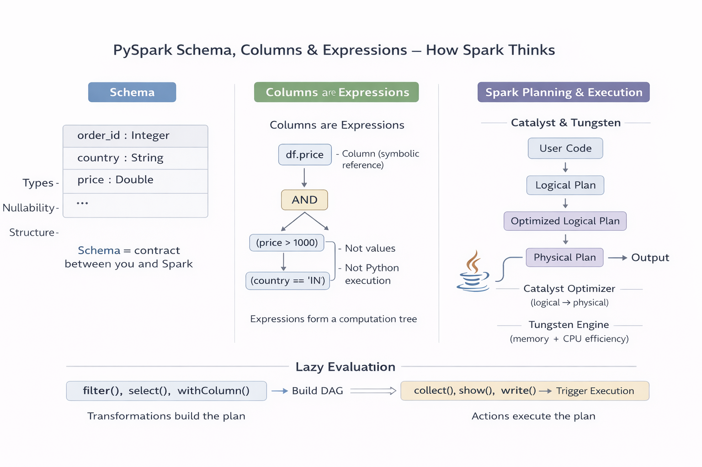

# Topic 3 - Schema, Columns & Expressions
---
>In DataFrames, Spark **avoids** Python row-by-row execution _unless you force it via UDFs or RDDs_.  
>
>You are building an _expression tree_, not running code.
---


---
## Schema

### What a schema really is

A schema is:
- Column names
- Column data types
- Nullability
- Nested structure (if any)

To Spark, **schema = truth**.

Without schema → Spark is blind.  
With schema → Spark can reason, optimize, and generate code.

---
#### Example: `explicit schema` (Spark always prefers this)
	> Same code available in `pyspark-lab` directory
```python
from pyspark.sql import SparkSession
from pyspark.sql.types import (
    StructType, StructField,
    IntegerType, StringType, DoubleType
)

spark = SparkSession.builder.getOrCreate()

schema = StructType([
    StructField("order_id", IntegerType(), nullable=False),
    StructField("country", StringType(), nullable=True),
    StructField("price", DoubleType(), nullable=True)
])

data = [
    (1, "IN", 1200.0),
    (2, "US", 800.0),
    (3, "IN", 1500.0)
]

df = spark.createDataFrame(data, schema)
df.printSchema()
df.show()
```
**Why this matters**
- No guessing (`inferSchema` is slow + risky)
- Spark knows types _before execution_
- Optimizer becomes stronger
---
### Mental model
```scss
Schema = contract between you and Spark
```
Break the contract → Spark guesses → performance drops.

---
## Columns — NOT values, but expressions

This is where most people mess up.

### What a Column actually is

A `Column` is:

> A **symbolic reference** to data that will exist later

It is **not**:
- A Python value
- A row value
- A computed result
#### Example
```python
type(df.price)
```
#### Output
```sql
pyspark.sql.column.Column
```
That’s not data.  
That’s a **placeholder in an expression tree**.

---
### Mental model
```scss
Column = future computation, not current value
```
Spark collects these columns, builds a plan, _then_ executes.

---
## Expressions — how Spark understands logic

Every DataFrame operation builds an **expression tree**.
#### Example: simple filter
```python
df.filter(df.price > 1000)
```
 
 - You are NOT doing a Python comparison.
 - You are building `(price > 1000)` as an **expression**.
 - Spark later converts this into JVM bytecode.
---
### Expressions are composable
```python
df.filter((df.price > 1000) & (df.country == "IN"))
```

This builds a tree like:
```scss
AND
 ├── price > 1000
 └── country == "IN"
```
---
## Column creation: withColumn (deep truth)

```python
df2 = df.withColumn("taxed_price", df.price * 1.18)
```

Important:
- This does NOT modify data
- This does NOT run immediately
- This adds a **new expression** to the plan
---
### Mental model
```scss
withColumn = add a new column expression
```
#### Common mistake (DON’T DO THIS)
```python
def add_tax(p):
    return p * 1.18

df.withColumn("taxed_price", add_tax(df.price)) 
```
Why this is bad:
- Python function breaks expression analysis
- Forces Python execution or UDF path
- Catalyst optimization is weakened
---
## Built-in functions = optimizer-friendly

Always prefer `pyspark.sql.functions`.
```python
from pyspark.sql.functions import col, when

df.withColumn(
    "price_bucket",
    when(col("price") > 1000, "HIGH").otherwise("LOW")
)
```

Spark sees:
- Full expression tree
- Can optimize
- Can push down logic
---
## SQL strings vs Column expressions

These two are **equivalent**:
```python
df.filter(df.price > 1000)

or 

df.filter("price > 1000")
```

But **Column expressions are safer**:
- Type-checked
- Refactor-friendly
- IDE support
---
### Mental model

> Use SQL strings for quick exploration  
> Use Column expressions for real code

---
## Nullability — silent killer

Spark follows **SQL null semantics**.

#### Example

```python
df.filter(df.price > 1000)
```

If `price` is NULL → row is dropped.

Why?

```scss
NULL > 1000 → NULL → treated as FALSE
```

### Correct handling
```python
df.filter(df.price.isNotNull() & (df.price > 1000))

or 

df.na.fill({"price": 0})
```

---
## Schema evolution (important for pipelines)

Every DataFrame transformation returns a **new DataFrame**.

```python
df1 = df.select("order_id", "price") 
df2 = df1.withColumn("discount", df1.price * 0.9)
```

Old schema remains untouched.

---
### Mental model
```scss
DataFrames are immutable DAG nodes
```

---

## Final Mental Model

> **You are not writing data-processing code.  
> You are describing a computation graph.**

Spark:
- Analyzes it
- Optimizes it
- Executes it

Your job:
- Use schema
- Use column expressions
- Avoid Python logic in the middle
---
## Final in one-liners
- Columns are expressions, not values.
- Schema is what enables optimization.
- DataFrames build plans, actions execute them.
- Avoid Python functions inside DataFrame logic.
- If Spark can’t see it, it can’t optimize it.
---
